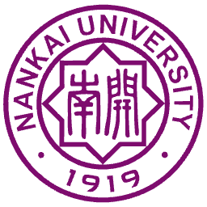

<!-- 




 -->

Hello everyone, my name is Xiuming Liu (刘修铭, in Chinese). I am currently an intern at [Ant Research](https://www.antresearch.com/) under Ant Group. I was also an undergraduate student majoring in information security at [College of Cryptology and Cyber Science, Nankai University](https://cyber.nankai.edu.cn/). In September this year, I will enter [Shanghai Jiao Tong University](https://www.cs.sjtu.edu.cn/) to pursue a master's degree (2025.09 - 2028.04), and my supervisor is Associate Professor [Shuo Wang](https://infosec.sjtu.edu.cn/DirectoryDetail.aspx?id=181) and Assistant Researcher [Chaoxiang He](https://infosec.sjtu.edu.cn/DirectoryDetail.aspx?id=191).

I have organized the [lab materials](https://github.com/lxmliu2002/NKU-courses) for the Information Security major courses at Nankai University, as well as the [lecture notes and past exam papers](https://github.com/lxmliu2002/NKU-cyber) for theoretical courses. Detailed content can be found at [Baidu Cloud](https://pan.baidu.com/s/1XEdQ580od2ExjIEDnVg0mA?pwd=iNKU).

My primary research interests lie in the areas of **security for single-modal and multi-modal large models**, **multi-agent collaborative systems and their security**, as well as **the interpretability of artificial intelligence**. 

My research aims to build safe, reliable, and transparent AI systems, with the goal of creating a more trustworthy AI environment that addresses pressing societal needs in privacy protection, decision-making transparency, and system robustness.

You can contact me via the following emails:

  - lxmliu2002 *[at]* 126.com

  - lxmliu2002 *[at]* gmail.com

  - lxmliu2002 *[at]* mail.nankai.edu.cn

  - liuxiuming.lxm *[at]* antgroup.com

  - lxmliu2002 *[at]* sjtu.edu.cn

<!-- My research interest includes neural machine translation and computer vision. I have published more than 100 papers at the top international AI conferences with total <a href='https://scholar.google.com/citations?user=DhtAFkwAAAAJ'>google scholar citations <strong>260000+</strong></a> (You can also use google scholar badge ). -->

# 🔥 News

*2025.08*: &nbsp;🎉🎉 After communicating with GitHub's support team for a full month, the website has finally been restored!

*2025.08*: &nbsp;🎉🎉 I have organized the [lab materials](https://github.com/lxmliu2002/NKU-courses) for the Information Security major courses at Nankai University, as well as the [lecture notes and past exam papers](https://github.com/lxmliu2002/NKU-cyber) for theoretical courses. Detailed content can be found at [Baidu Cloud](https://pan.baidu.com/s/1XEdQ580od2ExjIEDnVg0mA?pwd=iNKU).

*2025.07*: &nbsp;🎉🎉 Our case study on *"Multimodal Large Models Empowering Early Screening and Accurate Diagnosis of Serious Diseases"* was awarded the **"Al & SDGs: Top 10 Beacon Initiatives"** at the 2025 World Artificial Intelligence Conference.

*2025.06*: &nbsp;🎉🎉 I joined [Ant Group](https://www.antgroup.com/)'s [Cryptology Lab](https://antcplab.github.io/) as an intern. 

*2025.06*: &nbsp;🎉🎉 I obtained a Bachelor of Engineering degree from [Nankai University](https://www.nankai.edu.cn/). 

<!-- # 📝 Publications 

CVPR 2016

[Deep Residual Learning for Image Recognition](https://openaccess.thecvf.com/content_cvpr_2016/papers/He_Deep_Residual_Learning_CVPR_2016_paper.pdf)

**Kaiming He**, Xiangyu Zhang, Shaoqing Ren, Jian Sun

[**Project**](https://scholar.google.com/citations?view_op=view_citation&hl=zh-CN&user=DhtAFkwAAAAJ&citation_for_view=DhtAFkwAAAAJ:ALROH1vI_8AC) <strong></strong>
- Lorem ipsum dolor sit amet, consectetur adipiscing elit. Vivamus ornare aliquet ipsum, ac tempus justo dapibus sit amet. 

- [Lorem ipsum dolor sit amet, consectetur adipiscing elit. Vivamus ornare aliquet ipsum, ac tempus justo dapibus sit amet](https://github.com), A, B, C, **CVPR 2020** -->

# ⚙️ Projects

  

    

      
Mingqi

      
    

  

  

    

      <a href="http://mingqi.sh.cn/" target="_blank" rel="noopener"><strong>“Mingqi” Medical Imaging Large Model Matrix</strong></a>
    

    

      Subproject Leader
      Dec 2024 – Present
    

    <ul style="margin-top: 0.5em; padding-left: 1.5em;">
      <li>Multi-granularity features + domain-specific LLM → endoscopic reports with >20% higher semantic similarity.</li>
      <li>Enhanced cross-modal image-text retrieval via fine-tuned PMC-CLIP, achieving precise case matching with >30% higher accuracy.</li>
      <li>Built 20-hr Mandarin medical speech corpus (via voice cloning), reducing ASR false positive rate by >20%.</li>
      <li>Recognized as one of the Top 10 AI Application Scenarios at the 2nd Belt and Road Sci-Tech Exchange Conference; awarded Top 10 Outstanding Cases of AI for Sustainable Development.</li>
    </ul>
  

  

    

      
ArXivToday

      
    

  

  

    

      <a href="https://github.com/InfinityUniverse0/ArXivToday-Lark" target="_blank" rel="noopener"><strong>ArXivToday-Lark: Automated arXiv Paper Delivery for Lark Teams</strong></a>
    

    

      Key Team Member
      Mar 2025 – Mar 2025
    

    <ul style="margin-top: 0.5em; padding-left: 1.5em;">
      <li>Developed a lightweight automation tool that fetches the latest arXiv papers daily and delivers them directly to Lark group chats via a custom bot, streamlining research discovery for academic teams.</li>
      <li>Features include scheduled fetching, customizable topic filters, LLM-powered paper summarization and translation, and influence prediction (in development).</li>
      <li>Designed for extensibility—supports integration with other messaging platforms and backend enhancements for intelligent paper recommendation.</li>
    </ul>
  

  

    

      
T2I-Fuzzer

      
    

  

  

    

      <a href="https://tianchi.aliyun.com/competition/entrance/532268" target="_blank" rel="noopener"><strong>T2I-Fuzzer: Jailbreaking Text-to-Image Large Models via Hybrid Strategies</strong></a>
    

    

      Key Team Member
      Sep 2024 – Oct 2024
    

    <ul style="margin-top: 0.5em; padding-left: 1.5em;">
      <li>Designed multi-level attack strategies to expose vulnerabilities in T2I models, optimizing adversarial efficacy from a zero-sum game perspective.</li>
      <li>Implemented a unified attack and evaluation framework, enabling efficient and stealthy rewriting of harmful prompts to bypass safety filters in T2I systems.</li>
      <li>Participated in the overall framework design and conducted testing of attack schemes such as adversarial captioning; built an attack knowledge base and implemented automatic prompt sanitization.</li>
    </ul>
  

  

    

      
Web3_MLM

      
    

  

  

    

      <a href="https://mlm01.com" target="_blank" rel="noopener"><strong>Web3_MLM: Intelligent Reverse Analysis for Solidity Smart Contracts</strong></a>
    

    

      Team Member
      Jan 2024 – Apr 2024
    

    <ul style="margin-top: 0.5em; padding-left: 1.5em;">
      <li>Supervisor: <strong><a href="https://netsec.ccert.edu.cn/chs/people/chaoz/" target="_blank" rel="noopener noreferrer">Chao Zhang</a></strong>, Associate Professor, Tenured, Deputy Director of Institute for Network Sciences, Tsinghua University</li>
      <li>Web3_MLM is a subset of the <strong><a href="https://mlm01.com" target="_blank" rel="noopener noreferrer">MLM</a></strong> project, providing an intelligent reverse analysis solution for Solidity smart contracts.</li>
      <li>Constructed a high-quality, comprehensive dataset containing Solidity source code, assembly code, and bytecode; performed data augmentation and aligned data formats at both contract-level and function-level granularity.</li>
    </ul>
  

  

    

      
RMDB

      
    

  

  

    

      <strong>RMDB: Database Management System for the National Contest on System Capacity</strong>
    

    

      Key Team Member
      May 2024 – Aug 2024
    

    <ul style="margin-top: 0.5em; padding-left: 1.5em;">
      <li>Enhanced a database management system within a given framework to support MySQL-like SQL functionalities.</li>
      <li>Implemented storage management module, contributing to over 35% of the team's completed tasks in the preliminary round.</li>
      <li>Participated in optimizing the <code>COUNT(*)</code> etc. query, achieving approximately 10% performance improvement.</li>
    </ul>
  

  

    

      
SysY-to-ARM

      
    

  

  

    

      <a href="https://github.com/lxmliu2002/Principles_of_Compilation_Systems" target="_blank" rel="noopener"><strong>SysY-to-ARM Compiler</strong></a>
    

    

      Team Header
      Oct 2023 – Jan 2024
    

    <ul style="margin-top: 0.5em; padding-left: 1.5em;">
      <li>Developed a compiler from SysY (educational language) to ARM assembly in C++, covering full compilation pipeline.</li>
      <li>Implemented lexing (Flex), parsing (Yacc), backpatching-based control flow translation, and optimizations (CSE, DCE).</li>
    </ul>
  

  

    

      
CodeHint

      
    

  

  

    

      <a href="https://github.com/lxmliu2002/ZRGJ2023" target="_blank" rel="noopener"><strong>Python Code Completion System Based on Neo4j Graph Database</strong></a>
    

    

      Team Member
      Jul 2023 – Aug 2023
    

    <ul style="margin-top: 0.5em; padding-left: 1.5em;">
      <li>Developed a context-aware Python code completion system using Neo4j as a graph database to infer variable types, addressing the lack of built-in type hinting in standard Python interpreters.</li>
      <li>Responsible for syntactic analysis of input code and querying the graph database; implemented path traversal logic to retrieve successor nodes, perform type inference, and return results to the frontend.</li>
      <li>Designed with extensibility in mind—can be adapted into a VS Code extension for real-time intelligent code suggestions.</li>
    </ul>
  

  

    

      
JingZhiYao

      
    

  

  

    

      <strong>JingZhiYao: A Blockchain-Based Scheme for Precise Rumor Refutation and Traceability</strong>
    

    

      Team Member
      May 2023 – Jul 2023
    

    <ul style="margin-top: 0.5em; padding-left: 1.5em;">
      <li>Designed a cross-platform rumor governance scheme leveraging blockchain technology, aiming to optimize key stages in rumor management including rumor identification, precise refutation, and traceability for accountability.</li>
      <li>Responsible for the design and implementation of the database, as well as backend database integration; achieved secure data upload, encryption, storage, and smart contract-based retrieval for message matching, verification, and filtering, supporting information traceability and evidence preservation.</li>
    </ul>
  

  

    

      
Zouma

      
    

  

  

    

      <a href="https://github.com/lxmliu2002/Zouma" target="_blank" rel="noopener"><strong>Zouma: A C++ Graphical Game with Winter Olympics Theme</strong></a>
    

    

      Course Project
      Apr 2022 – May 2022
    

    <ul style="margin-top: 0.5em; padding-left: 1.5em;">
      <li>Developed a Zouma-style puzzle game in C++ using the EasyX graphics library, featuring a custom game loop, path-based ball movement, and interactive cannon control with real-time mouse tracking.</li>
      <li>Implemented core mechanics including ball trajectory generation (via linear interpolation of key points), collision detection, ball elimination logic, and dynamic visual effects (e.g., rotating "Bing Dwen Dwen" character).</li>
      <li>Integrated background music and sound effects using Windows MCI API; designed start screen, win/loss detection, and smooth transitions between game states.</li>
      <li>Awarded **2nd place in class** for creativity, code quality, and user experience in the course project evaluation.</li>
    </ul>
  

# 🎖 Honors and Awards

- *2025.07*: &nbsp;🎖 Top 10 Outstanding Cases of AI for Sustainable Development，Awarded to the ***Mingqi*** team at the 2nd Belt and Road Sci-Tech Exchange Conference

- *2025.06*: &nbsp;🎖 Outstanding Student Party Member of Nankai University

- *2025.06*: &nbsp;🎖 Head of Red Flag Party Branch of Nankai University

- *2025.05*: &nbsp;💰 Zhou Enlai Scholarship [(the highest scholarship of Nankai University)](https://mp.weixin.qq.com/s/KnG_0Qekv1N_9SGn0ALcKw?click_id=44)

- *2025.04*: &nbsp;💰 First Prize of Yun'an Cryptography Innovation Scholarship

- *2024.12*: &nbsp;💰 National Scholarship (Top 1%)

- *2024.12*: &nbsp;🎖 Outstanding Student of Nankai University

- *2024.12*: &nbsp;💰 Ninety-five Core Scholarship, Nankai University (10 Students in Nankai University)

- *2024.12*: &nbsp;🎖 Outstanding Student Cadre of Tianjin

- *2024.08*: &nbsp;🏆 Third Prize of National College Students' Computer System Ability Competition

- *2024.06*: &nbsp;🎖 Head of the "I Do Practical Things for My Classmates" Excellent Project of the All-China Students' Federation

- *2023.11*: &nbsp;🏆 Second Prize of the Tianjin Division of the National College Students' Mathematical Modeling Competition

- *2022.12*: &nbsp;💰 National Scholarship (Top 1%)

# 📖 Educations

- *2021.09 - 2025.06*, **[College of Cryptology and Cyber Science](https://cyber.nankai.edu.cn/), [Nankai University](https://www.nankai.edu.cn/)**

  *- Bachelor of Information Security, Ranked 1st in the grade*

- *2025.09 - Present*, **College of Cyber Science, [Shanghai Jiao Tong University](https://www.sjtu.edu.cn/)**

  *- Master of Electronic Information*

  *- Lab: Laboratory of Cryptography and Computer Security (LoCCS), Supervisor: [Shuo Wang](https://infosec.sjtu.edu.cn/DirectoryDetail.aspx?id=181)*

# 💻 Internships

- *2025.06 - 2025.09 (now)*, [Ant Group](https://www.antgroup.com/), Hangzhou, China.

  *- Lab: [Cryptology Lab](https://antcplab.github.io/), Supervisor: Zhicong Huang*

- *2025.01 - 2025.06*, Wuxi Blockchain Advanced Research Center, Wuxi, China.

  *- Lab: Artificial Intelligence and Data Security Lab, Supervisor: [Shuo Wang](https://infosec.sjtu.edu.cn/DirectoryDetail.aspx?id=181), [Chaoxiang He](https://infosec.sjtu.edu.cn/DirectoryDetail.aspx?id=191)*

# 🪽 Beyond Academics

I like **music, billiards, traveling and badminton**. At the same time, I am also keen to try various positions of student work. I am a **warm-hearted person**. If you encounter any problems, you can always come to me and I will do my best to help you.

  
  
  

<footer class="site-footer">
  
&copy; 2025 <a href="https://github.com/lxmliu2002" target="_blank" rel="noopener">Xiuming Liu</a> all rights reserved

  

    Template adapted from
    <a href="https://github.com/RayeRen/acad-homepage.github.io" target="_blank" rel="noopener">Yi Ren</a>
  

  
Last modified: <time datetime="{{ site.time | date_to_xmlschema }}">{{ site.time | date: "%b %d, %Y" }}</time>

</footer>